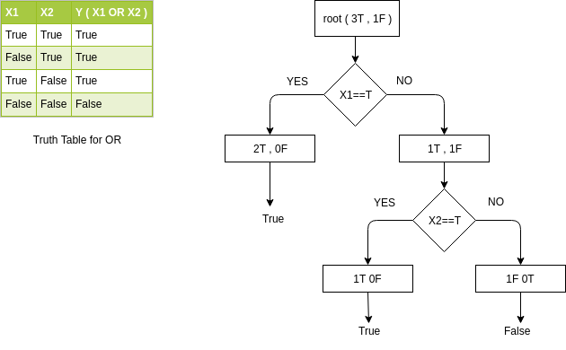

# Decision Tree  
A decision tree is a graph that uses a branching method to illustrate every possible outcome of a decision. Lets start by taking a example of OR of two variables X1 and X2. The decison tree for the same is shown below :
 
 

 
We have total four possible combinations as shown in the truth table.    
So at the beginning we have 2 True and 2 False outcomes to start with.
 
 
The first condition we check for is the value of X1. If X1 is true then we are sure that the result will be true and hence we arrive at 2 true and no false. Note that ,we only consider those rows of the table which are having X1 as true i.e. the first and the third row in the current example .That is why we have 2 total outcomes out of which 2 are true and none is false. This node is having a definite answer.If we arrive at this node there is no confusion as to which what our tree should return, therefore these are called <b>pure nodes</b>. 
 
If X1 is false then the answer is dependant on the value of X2. If X2 is false the answer is false and if the answer is true the final result is true. We have three pure nodes here as shown in the pictorial representation of the decision tree.    
 
Now if we are given any new data for prediction we just need to run it through our tree. For example if we get A and B as two values for testing. We check first if A is true. If A is true we have true as our answer else we need to check for the value of B. If B is true then our answer agin is true else we have false as the final outcome.

